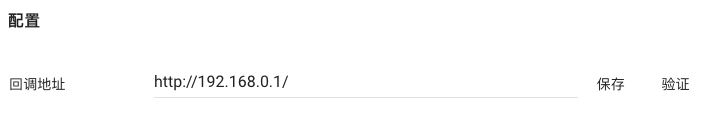

## 回调地址

将 PPT 转化成 H5 是一个长时间的异步过程。当转化结束时，PP 匠服务器会主动发送一个通知请求到客户服务器，来告知客户下载转化后的 H5 文件。因此客户需要在后台配置回调地址。

### 配置回调地址

保存后需要点击“验证”按钮来发送验证请求；只有验证通过的服务器才会在之后收到回调请求。

### 验证请求
curl https://your_server_notify_address?type=verify&amp;nonce=XXXXX


#### 参数

参数名|类型|值|描述
---|---|---|---
type|string|'verify'|该请求类型，'verify' 表示验证
nonce|string||随机字符串

#### 期待响应

Content-Type: 'application/json'

{
  'nonce': 'XXXXXXX'
}


客户服务器返回一个 json 格式值，包含请求发送的 nonce 值，则PP匠这边就会标记该服务器验证通过。

### 通知请求

当一个 Job 完成，或者出错时，PP 匠会主动发一个通知请求来告知客户。

 curl https://your_server_notify_address?type=XXX&token=XXX&code=XXXX


#### 参数

参数名|类型|值|描述
---|---|---|---
type|string|['complete', 'error']|分别表示token对应的Job完成或者失败
token|string||Job标识码，见 [创建一个Job](./resources/job.md#创建一个job).
code|integer|[1, 2]|出错状态码, 1 表示PP匠服务器内部出错导致无法转化 2 表示上传的PPT源文件有问题，导致无法转化

#### 期待响应

{}


一个通知请求需要在 10 秒内回复，否则 PP 匠会认为通知发送失败，会在几秒后重复推送，直到收到成功返回（Status: 200）为止。

_请先响应通知，再处理您的业务逻辑_

### 请求签名

PP 匠通知客户的请求，也做了签名处理。客户服务器应__自行决定__是否需要验证 PP 匠发送的请求。

与[授权验证](./overview.md#授权验证)稍有不同的是，参数只包含 Timestamp 和 Signature。 PP 匠服务器采用设置 headers 的方式发送请求。


curl -H 'X-PPJ-Timestamp: XXXXXXXXXX' \
     -H 'X-PPJ-Signature: AUTH-TOKEN' \
     https://your_server_notify_address?whatever


示例见[签名算法](./signature.md#pp-匠发送一个通知请求示例)。
